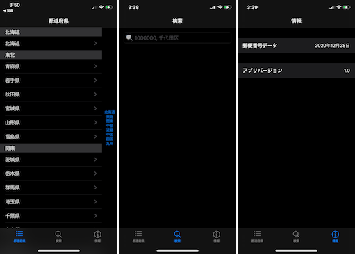

# Zip code search app

An app that allows you to search for a zip code

I tried Apple's Swift UI Tutorials, so a sample app that uses UI parts in a similar way.

## Development Environment

* Xcode 12.4 (12D4e)
* Swift 5.3.2

## Supported OS

* iOS14 or later

## Use Data

Use the following postal code database  
https://github.com/ynug/convertPostalCodeToSqlite

## Known issues

* When searching again with many search results, it freezes.
I don't know if it's badly implemented or a List bug

